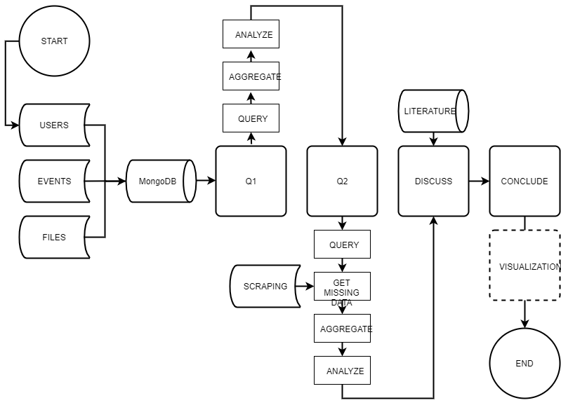
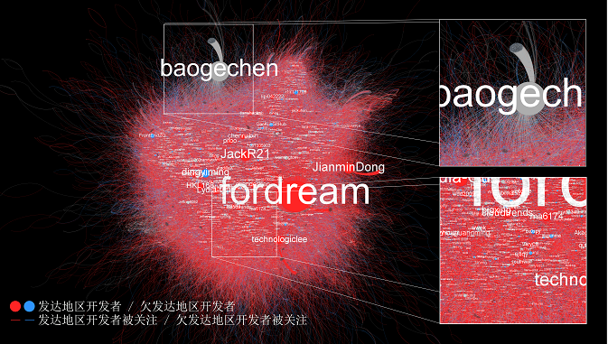

# Homework 1

For Big Data Analysis [HW1](https://github.com/hyzphbs/2019.M2.BigData/blob/master/homework_1.pdf).

## Content

- [Homework 1](#homework-1)
  - [1. Find an interesting big data problem and explain the intrinsic big data properties.](#1-find-an-interesting-big-data-problem-and-explain-the-intrinsic-big-data-properties)
    - [Problem](#problem)
    - [Why interesting](#why-interesting)
    - [Why big](#why-big)
  - [2. Propose a workflow to solve this problem](#2-propose-a-workflow-to-solve-this-problem)
    - [Breaking down a problem](#breaking-down-a-problem)
    - [Constructing a workflow](#constructing-a-workflow)
  - [3. Decide what kind of databases to be used](#3-decide-what-kind-of-databases-to-be-used)
    - [Database](#database)
    - [Explanation](#explanation)
  - [4. Preliminary result](#4-preliminary-result)
  - [Note](#note)
  - [Reference](#reference)

## 1. Find an interesting big data problem and explain the intrinsic big data properties.

Though a widely accpeted definition without any confusion or debates has not been brought up, a big data problem often refers to one of those specific problems with "3V" properties: volume, variety, and velocity.

### Problem

The problem on how Chinese GitHub developers' registrating accounts, following other users, and generating cotents differ among individuals from discrepant geographical lacations is an interesting big data one to me.

### Why interesting

GitHub, a platform for developing softeware collaborately, has been widely seen as "democratic and decentralized" (Vasilescu, Yu, Wang, Devanbu, & Filkov, 2015) due to its distributed Git technology in a long time.

However, it seems that Chinese developers in this online community from different offline areas attract followers in different ways or with various outcomes. From the perspective of social capital, this phenomenon means their capital of online social relationships differs.

Does geographical factors in reality affects online societies? Figuring out what the real pattern and the real reason behind it may provide insights understanding the transition of social relationship or structure from the real society to online communities.

### Why big

This proplem is exactly a big data one because the data of this research object is a big project designing to mirror the GitHub public timeline for acdemic purposes(Gousios and Spinellis, 2012), which do have "3V" properties.

- **Volume**
  The [GHTorrent](http://ghtorrent.org/) project stores 102973 MB data currently([2019-06-01](http://ghtorrent.org/downloads.html)), which is large in its volume comparing to usual datasets.
- **Variety**  
  The data provided in this dataset are about not only the user information but also lots of user triggerd events. Those information and events contain various variables in various types.
- **Velocity**  
  Comparing to any other records on working or collaborating in the old time, the speed of incresing of those information is much faster: 4 GB on each day only including recorded public events.

Thus, this problem, based on 102 TB not only various but also fastly growing data, is a big data one.

## 2. Propose a workflow to solve this problem

### Breaking down a problem

This question contains two sub-questions:  
**Q1.** Does their social relationship various among locations?  
**Q2.** If true, how and why does this happen?

### Constructing a workflow

To answer these questions, this research can be divided into two parts: description and explanation. Thus, a two stage work flow can be introduced.

## 3. Decide what kind of databases to be used

The choice need to be done is mainly about whether to use a relational database or an non-relationnal one.

### Database

In this case, [MongoDB](https://www.mongodb.com/), which is a widely used non-relational database, is the best choice

### Explanation

MongoDB is a cross-platform document-oriented database program. Classified as a NoSQL database program, MongoDB uses JSON-like documents with schema. Key features considered in this issue are:

**1. Non-relational** database is helpful dealing with big volume and horizontally scaling datasets. Though a sub-question in this research is finding their following relationships, MongoDB provides some useful and easy-to-use tools to get SQL-like features instead of far more difficult solutions to solve NoSQL problems in SQL databases.

**2. Object-oriented programming** is fundemental when tackling with not only simple key-value pairs but also embedded documents and various event records. Json data in MongoDB provides information about individuals as objects for futher exploring.

**3. Data source** is another crucial reason. The GHTorrent provides information in both MySQL and MongoDB, therefore, its convinient to get json data to store and analyze.

## 4. Preliminary result

Visualization of the following relationship among Chinese GitHub users (2008-2016):

This figure indicates that social capital between developers from developed areas and developing area do vary, which answers Q1.

## Note

Related research above has been orally presented at _Journalism and Communication PhD Student Conference of Peking University (2019)_ and will be partially demonstrated at [_China Computational Communication Research Annual Conference (2019)_](https://ccr-china.github.io/post/2019-09-22-conference/). All rights reserved.

## Reference

Gousios, G., & Spinellis, D. (2012, June). GHTorrent: GitHub's data from a firehose. In _2012 9th IEEE Working Conference on Mining Software Repositories (MSR)_ (pp. 12-21). IEEE.

Vasilescu, B., Yu, Y., Wang, H., Devanbu, P., & Filkov, V. (2015, August). Quality and productivity outcomes relating to continuous integration in GitHub. In _Proceedings of the 2015 10th Joint Meeting on Foundations of Software Engineering_ (pp. 805-816). ACM.
